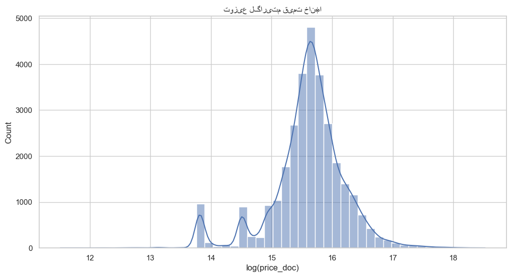

# گزارش کار پروژه رگرسیون — پیش‌بینی قیمت مسکن (Sberbank Russian Housing Market)

**درس:** یادگیری ماشین  
**موضوع:** رگرسیون خطی چندمتغیره  
**دیتاست:** Sberbank Russian Housing Market (Kaggle)

---

## فهرست مطالب

1. [چکیده](#۱-چکیده)
2. [مقدمه و هدف پروژه](#۲-مقدمه-و-هدف-پروژه)
3. [توصیف مجموعه‌داده](#۳-توصیف-مجموعه‌داده)
4. [پیش‌پردازش و اکتشاف داده](#۴-پیش‌پردازش-و-اکتشاف-داده)
5. [مدل رگرسیون خطی چندمتغیره](#۵-مدل-رگرسیون-خطی-چندمتغیره)
6. [معیارهای ارزیابی و نتایج](#۶-معیارهای-ارزیابی-و-نتایج)
7. [تحلیل نتایج و مقایسه](#۷-تحلیل-نتایج-و-مقایسه)
8. [نتیجه‌گیری](#۸-نتیجه‌گیری)
9. [منابع و مراجع](#۹-منابع-و-مراجع)

---

## ۱. چکیده

در این پروژه با استفاده از مجموعه‌داده **Sberbank Russian Housing Market** یک مدل رگرسیون خطی چندمتغیره برای پیش‌بینی قیمت فروش مسکن (متغیر `price_doc` به واحد روبل) پیاده‌سازی شده است. پس از بارگذاری داده، مدیریت مقادیر گمشده با میانه، و استفاده از ویژگی‌های عددی، مدل با معیارهای MSE، RMSE، MAE و R² ارزیابی شده و مقدار **R² ≈ ۰٫۷۶** به‌دست آمده است که نشان‌دهنده عملکرد قابل‌قبول مدل روی این دیتاست چالش‌برانگیز است.

---

## ۲. مقدمه و هدف پروژه

هدف این گزارش، مدل‌سازی یک سیستم پیش‌بینی مبتنی بر **رگرسیون** با استفاده از مجموعه‌داده پیشنهادی است. مجموعه‌داده انتخاب‌شده **Sberbank Russian Housing Market** (شماره ۱۷ در لیست پیشنهادی) از مسابقات Kaggle است.

**الزامات انجام‌شده طبق صورت‌جلسه:**

| ردیف | الزام | وضعیت |
|------|--------|--------|
| ۱ | Import کتابخانه‌های لازم | ✓ |
| ۲ | بارگذاری و بررسی کامل دیتاست | ✓ |
| ۳ | شناسایی و مدیریت مقادیر گمشده | ✓ |
| ۴ | ترسیم نمودارهای متعدد برای درک داده | ✓ |
| ۵ | آموزش مدل رگرسیون خطی چندمتغیره | ✓ |
| ۶ | ارزیابی با MSE، RMSE، MAE و R² Score | ✓ |

پروژه در محیط **Jupyter Notebook** پیاده‌سازی شده و در این گزارش از **نمودارها** و **جداول** خروجی استفاده شده است.

---

## ۳. توصیف مجموعه‌داده

### ۳.۱ مشخصات کلی

| ویژگی | مقدار |
|--------|--------|
| **نام دیتاست** | Sberbank Russian Housing Market |
| **منبع** | [Kaggle - Sberbank Russian Housing Market](https://www.kaggle.com/c/sberbank-russian-housing-market) |
| **تعداد رکوردهای آموزشی** | ۳۰٬۴۷۱ |
| **تعداد ستون‌ها (ویژگی‌ها)** | ۲۹۲ |
| **تعداد ویژگی‌های عددی استفاده‌شده** | ۲۷۵ |
| **متغیر هدف** | `price_doc` (قیمت فروش به روبل) |

### ۳.۲ نمونه ویژگی‌های مهم

- `full_sq`: مساحت کل ملک  
- `life_sq`: مساحت زندگی  
- `num_room`: تعداد اتاق  
- `floor`: طبقه  
- `build_year`: سال ساخت  
- فاصله تا مرکز شهر، ایستگاه مترو و امکانات اطراف (مثلاً تعداد کافه، ورزشگاه و ...)

این دیتاست شامل اطلاعات واقعی بازار مسکن روسیه است. چالش‌های اصلی آن **مقادیر گمشده زیاد** در بسیاری از ستون‌ها و **توزیع نامتوازن (چوله)** قیمت‌هاست.

---

## ۴. پیش‌پردازش و اکتشاف داده

### ۴.۱ بارگذاری و ابعاد داده

دیتاست از فایل `train.csv` خوانده شده است:

- **تعداد ردیف‌ها:** ۳۰٬۴۷۱  
- **تعداد ستون‌ها:** ۲۹۲  

ویژگی‌های عددی (به‌جز `id` و `price_doc`) برای مدل استفاده شده‌اند.

### ۴.۲ توزیع متغیر هدف (قیمت)

توزیع قیمت خانه‌ها (`price_doc`) به‌طور معمول **چوله به راست (right-skewed)** است. برای درک بهتر، علاوه بر توزیع اصلی، توزیع **لگاریتم قیمت** نیز رسم شده است.

**نمودار ۱ — توزیع قیمت خانه‌ها (price_doc)**


**نمودار ۲ — توزیع لگاریتم قیمت (log(price_doc))**



```python
plt.figure(figsize=(8, 4))
sns.histplot(df["price_doc"], bins=50, kde=True)
plt.xlabel("price_doc")
plt.title("توزیع قیمت مسکن")
plt.show()

plt.figure(figsize=(8, 4))
sns.histplot(np.log1p(df["price_doc"]), bins=50, kde=True)
plt.xlabel("log(price_doc)")
plt.title("توزیع لگاریتم قیمت مسکن")
plt.show()
```

در نمودار اول توزیع خام قیمت‌ها رسم شده که چوله به راست است؛ یعنی تعداد زیادی ملک با قیمت‌های نسبتاً پایین و تعداد کمی ملک با قیمت‌های بسیار بالا وجود دارد. در نمودار دوم با اعمال تبدیل لگاریتمی، توزیع متعادل‌تر می‌شود و این به درک بهتر ساختار داده و در بسیاری موارد به بهبود عملکرد مدل کمک می‌کند.

### ۴.۳ مقادیر گمشده

بسیاری از ستون‌ها دارای مقادیر گمشده هستند؛ در برخی موارد بیش از ۵۰٪. برای مدیریت آن‌ها از **پر کردن با میانه (median)** برای ویژگی‌های عددی استفاده شده است (به‌دلیل مقاومت در برابر outlier).

**نمودار ۳ — ۳۰ ستون با بیشترین درصد داده گمشده**


```python
missing_ratio = df.isnull().mean().sort_values(ascending=False)

top_missing = missing_ratio.head(30)

plt.figure(figsize=(10, 6))
sns.barplot(x=top_missing.values, y=top_missing.index)
plt.xlabel("نسبت داده گمشده")
plt.ylabel("ستون")
plt.title("۳۰ ستون با بیشترین نسبت مقادیر گمشده")
plt.show()
```

در این قطعه‌کد ابتدا نسبت مقادیر گمشده برای هر ستون محاسبه و بر اساس بیشترین مقدار مرتب می‌شود. سپس ۳۰ ستون نخست انتخاب و به صورت نمودار ستونی نمایش داده می‌شوند تا ستون‌هایی که بیشترین مشکل داده گمشده را دارند به‌وضوح مشخص شوند.

### ۴.۴ همبستگی و پراکندگی

برای بررسی رابطه بین مساحت کل ملک و قیمت، نمودار پراکندگی `full_sq` در مقابل `price_doc` رسم شده و **همبستگی قوی** مشاهده می‌شود. همچنین ماتریس همبستگی برای ویژگی‌های با بیشترین همبستگی با `price_doc` ترسیم شده است.

**نمودار ۴ — پراکندگی قیمت بر حسب مساحت کل (full_sq)**


**نمودار ۵ — ماتریس همبستگی ویژگی‌های مهم**


```python
plt.figure(figsize=(8, 6))
sns.scatterplot(x=df["full_sq"], y=df["price_doc"], alpha=0.3)
plt.xlabel("full_sq")
plt.ylabel("price_doc")
plt.title("رابطه مساحت کل و قیمت")
plt.show()

corr_with_target = df.corr(numeric_only=True)["price_doc"].sort_values(ascending=False)

top_features = corr_with_target.head(10).index

plt.figure(figsize=(8, 6))
sns.heatmap(df[top_features].corr(), annot=False, cmap="coolwarm", center=0)
plt.title("ماتریس همبستگی ویژگی‌های مهم نسبت به price_doc")
plt.show()
```

نمودار پراکندگی نشان می‌دهد که با افزایش مساحت کل (`full_sq`) به طور کلی قیمت نیز افزایش می‌یابد، هرچند پراکندگی و نقاط پرت وجود دارد. در ادامه، با انتخاب تعدادی از ویژگی‌هایی که بیشترین همبستگی عددی با `price_doc` دارند، ماتریس همبستگی آن‌ها رسم شده تا وابستگی متقابل ویژگی‌های مهم و رابطه آن‌ها با متغیر هدف مشخص شود.

### ۴.۵ خلاصه پیش‌پردازش

| مرحله | روش |
|--------|------|
| انتخاب ویژگی | فقط ویژگی‌های عددی (حذف `id` و `price_doc` از X) |
| مقادیر گمشده | `SimpleImputer(strategy='median')` |
| تقسیم داده | ۸۰٪ train، ۲۰٪ test با `random_state=42` |

---

## ۵. مدل رگرسیون خطی چندمتغیره

### ۵.۱ تنظیمات مدل

- **مدل:** `sklearn.linear_model.LinearRegression`
- **ورودی:** ماتریس ویژگی‌های عددی پس از impute (۲۷۵ ویژگی)
- **خروجی:** پیش‌بینی `price_doc` (روبل)

### ۵.۲ کد خلاصه

```python
X = df.select_dtypes(include=['int64', 'float64']).drop(['id', 'price_doc'], axis=1, errors='ignore')
y = df['price_doc']
imputer = SimpleImputer(strategy='median')
X_imputed = pd.DataFrame(imputer.fit_transform(X), columns=X.columns)
X_train, X_test, y_train, y_test = train_test_split(X_imputed, y, test_size=0.2, random_state=42)
model = LinearRegression()
model.fit(X_train, y_train)
y_pred = model.predict(X_test)
```

در این قطعه‌کد:

- ابتدا تمام ستون‌های عددی انتخاب شده‌اند و ستون‌های `id` و `price_doc` از ورودی مدل حذف شده‌اند تا تنها ویژگی‌های توضیح‌دهنده در `X` باقی بمانند، در حالی که `price_doc` به‌عنوان متغیر هدف در `y` نگه‌داری می‌شود.  
- با استفاده از `SimpleImputer` مقادیر گمشده ویژگی‌ها با میانه هر ستون جایگزین شده‌اند تا مدل دچار خطا یا سوگیری ناشی از داده‌های ناقص نشود.  
- داده‌ها به دو بخش آموزش و آزمون تقسیم شده‌اند؛ ۸۰٪ برای آموزش و ۲۰٪ برای ارزیابی نهایی مدل.  
- یک شیء `LinearRegression` ساخته شده، روی داده‌های آموزشی برازش داده شده و سپس برای داده‌های آزمون پیش‌بینی قیمت (`y_pred`) محاسبه شده است.

---

## ۶. معیارهای ارزیابی و نتایج

### ۶.۱ معیارهای گزارش‌شده

| معیار | توضیح |
|--------|--------|
| **MSE** | میانگین مربعات خطا |
| **RMSE** | جذر MSE (هم‌مقیاس با قیمت) |
| **MAE** | میانگین قدر مطلق خطا |
| **R² Score** | ضریب تعیین (سهم واریانس توضیح‌داده‌شده توسط مدل) |

### ۶.۲ نتایج روی مقیاس اصلی قیمت (روبل)

| معیار | مقدار |
|--------|--------|
| **MSE** | ۵٬۰۸۹٬۷۳۲٬۴۴۸٬۸۹۷ |
| **RMSE** | ۲٬۲۵۶٬۰۴۴ |
| **MAE** | ۱٬۰۹۸٬۶۷۴ |
| **R² Score** | **۰٫۷۶۲۲** |

این نتایج نشان می‌دهند که مدل حدود **۷۶٪** از واریانس قیمت را توضیح می‌دهد و خطای متوسط پیش‌بینی (MAE) در حدود **۱٫۱ میلیون روبل** است.

```python
mse = mean_squared_error(y_test, y_pred)
rmse = np.sqrt(mse)
mae = mean_absolute_error(y_test, y_pred)
r2 = r2_score(y_test, y_pred)

print("MSE:", mse)
print("RMSE:", rmse)
print("MAE:", mae)
print("R2:", r2)
```

در این بخش با استفاده از توابع موجود در ماژول `sklearn.metrics` چهار معیار اصلی محاسبه شده‌اند. `MSE` میانگین مربع خطاها، `RMSE` ریشه دوم این مقدار و هم‌مقیاس با قیمت واقعی، `MAE` میانگین قدر مطلق خطاها و `R²` نشان‌دهنده سهم واریانس توضیح‌داده‌شده توسط مدل است. مقادیر گزارش‌شده در جدول بالا حاصل اجرای همین قطعه‌کد روی داده‌های آزمون هستند.

---

## ۷. تحلیل نتایج و مقایسه

### ۷.۱ نقاط قوت

- سادگی و تفسیرپذیری مدل رگرسیون خطی  
- سرعت آموزش بالا  
- R² ≈ ۰٫۷۶ برای دیتاستی با ۲۷۵ ویژگی و مقادیر گمشده زیاد، **قابل قبول** است  

### ۷.۲ نقاط ضعف و محدودیت‌ها

- عدم استفاده از ویژگی‌های کتگوریکال (نیاز به encoding)  
- وجود outlier و مقادیر گمشده که می‌تواند با روش‌های قوی‌تر مدیریت شود  
- توزیع چوله قیمت؛ در صورت استفاده از تبدیل لگاریتمی روی هدف، معیارها باید روی مقیاس اصلی تفسیر شوند  

### ۷.۳ پیشنهادات بهبود

| پیشنهاد | توضیح |
|----------|--------|
| Feature engineering | نسبت قیمت به مساحت، ادغام با `macro.csv` |
| مدیریت outlier | حذف یا وزن‌دهی نمونه‌های پرت |
| Regularization | Ridge یا Lasso برای پایداری ضرایب |
| مدل‌های پیشرفته‌تر | Random Forest، XGBoost و ... |

---

## ۸. نتیجه‌گیری

پروژه با موفقیت تمام الزامات صورت‌جلسه را برآورده کرده است. مدل **رگرسیون خطی چندمتغیره** با **R² = ۰٫۷۶** روی دیتاست Sberbank Russian Housing Market عملکرد قابل قبولی داشته است. این نتیجه نشان می‌دهد که روش‌های پایه در مسائل واقعی می‌توانند مفید باشند؛ با این حال با مهندسی ویژگی و مدل‌های پیشرفته‌تر می‌توان به دقت بالاتری دست یافت.

---

## ۹. منابع و مراجع

1. [Kaggle - Sberbank Russian Housing Market](https://www.kaggle.com/c/sberbank-russian-housing-market)
2. مستندات [scikit-learn](https://scikit-learn.org/) برای `LinearRegression` و معیارهای ارزیابی
3. کتابخانه‌های **pandas**، **matplotlib**، **seaborn**

---

**فایل‌های پروژه:**

| فایل / پوشه | توضیح |
|--------------|--------|
| `01_Regression_Sberbank_Housing.ipynb` | نوت‌بوک اصلی |
| `01_Regression_Sberbank_Housing.html` | خروجی اکسپورت‌شده نوت‌بوک |
| `data/` | دیتاست (مثلاً `train.csv`) |
| `images/` | نمودارهای شماره‌گذاری‌شده (۱ تا ۵) برای استفاده در گزارش |

---
