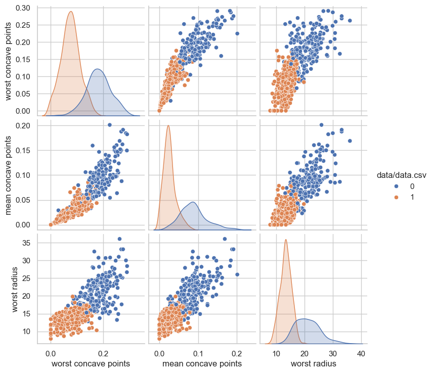
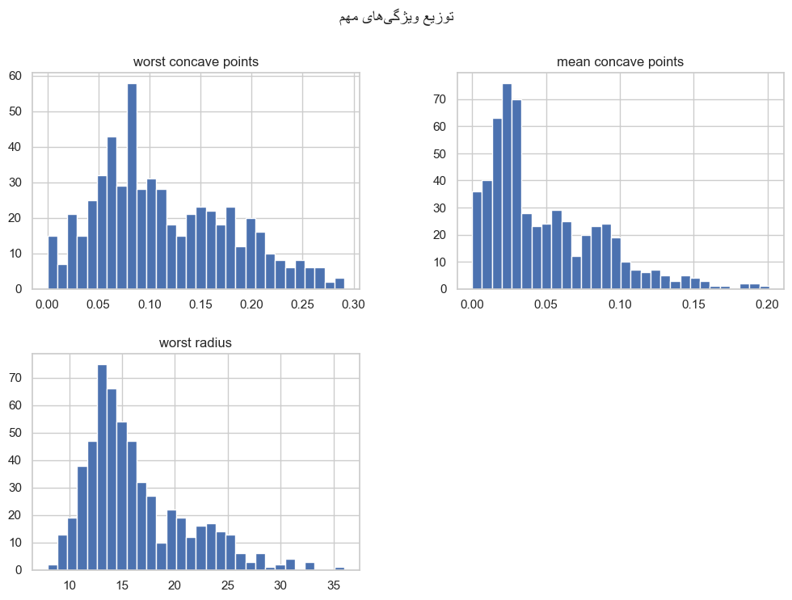
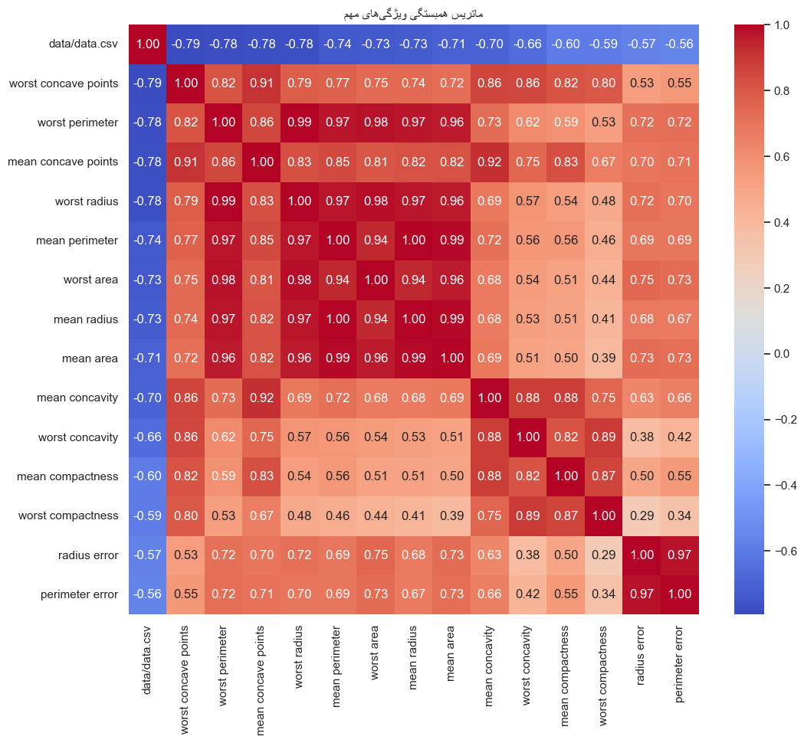
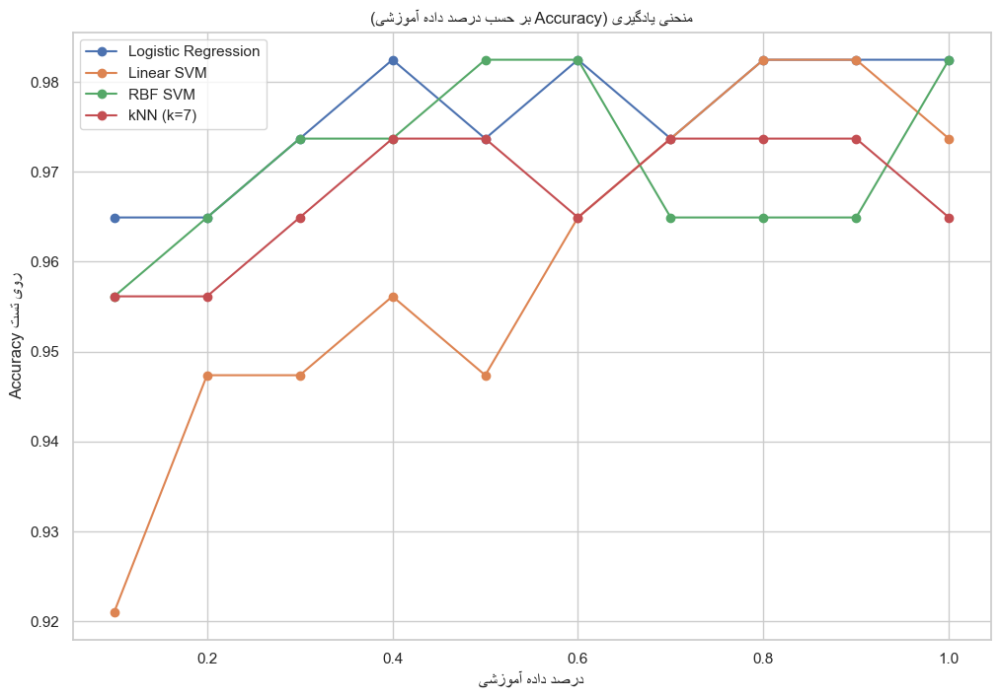
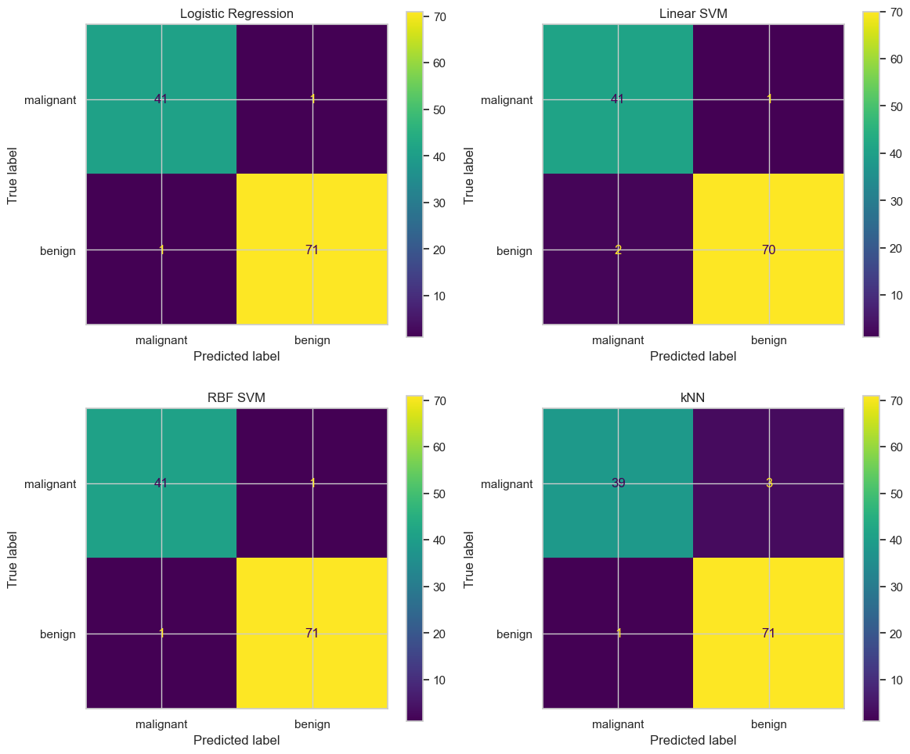

# گزارش کار پروژه طبقه‌بندی — تشخیص سرطان سینه

**درس:** یادگیری ماشین  
**موضوع:** طبقه‌بندی دودویی (تشخیص تومور خوش‌خیم و بدخیم)  
**دیتاست:** Breast Cancer Wisconsin (scikit-learn)

فایل نوت‌بوک اصلی: `02_Classification_Breast_Cancer.ipynb`  
خروجی HTML پروژه: `02_Classification_Breast_Cancer.html`

---

## فهرست مطالب

1. [چکیده](#۱-چکیده)
2. [مقدمه و هدف پروژه](#۲-مقدمه-و-هدف-پروژه)
3. [توصیف دیتاست](#۳-توصیف-دیتاست)
4. [پیش‌پردازش و اکتشاف داده](#۴-پیش‌پردازش-و-اکتشاف-داده)
5. [مدل‌های استفاده‌شده](#۵-مدلهای-استفادهشده)
6. [معیارهای ارزیابی و نتایج](#۶-معیارهای-ارزیابی-و-نتایج)
7. [تحلیل نتایج و مقایسه](#۷-تحلیل-نتایج-و-مقایسه)
8. [نتیجه‌گیری](#۸-نتیجه‌گیری)
9. [منابع و مراجع](#۹-منابع-و-مراجع)
10. [فایل‌های پروژه](#۱۰-فایلهای-پروژه)

---

## ۱. چکیده

در این پروژه با استفاده از دیتاست Breast Cancer Wisconsin یک مدل طبقه‌بندی برای تشخیص خوش‌خیم یا بدخیم بودن تومور سینه پیاده‌سازی شده است. پس از انجام تحلیل اکتشافی داده‌ها، مقیاس‌بندی ویژگی‌ها و تقسیم داده‌ها به مجموعه‌های آموزش و تست، چهار مدل کلاسیک یادگیری نظارت‌شده شامل **Logistic Regression**، **Linear SVM**، **RBF SVM** و **kNN** آموزش داده شده‌اند. دقت نهایی مدل‌ها روی داده تست بین **۰٫۹۶** تا **۰٫۹۸** به‌دست آمده است و مدل‌های Logistic Regression و RBF SVM بهترین عملکرد را نشان داده‌اند.

---

## ۲. مقدمه و هدف پروژه

هدف این پروژه، پیاده‌سازی یک مسئلهٔ **طبقه‌بندی دودویی** در چارچوب درس یادگیری ماشین است تا دانشجو با مراحل کامل یک خط لولهٔ یادگیری ماشین (از EDA تا ارزیابی و مقایسهٔ مدل‌ها) آشنا شود. مسئلهٔ انتخاب‌شده تشخیص بدخیم یا خوش‌خیم بودن تومور سینه بر اساس ویژگی‌های استخراج‌شده از تصاویر بافت است.

در این پروژه مراحل زیر مطابق صورت‌جلسه انجام شده است:

- بارگذاری و بررسی کامل دیتاست  
- تحلیل اکتشافی داده‌ها و ترسیم نمودارهای متنوع  
- پیش‌پردازش شامل مقیاس‌بندی و تقسیم داده‌ها به Train/Test  
- آموزش چند مدل طبقه‌بندی کلاسیک و تنظیم ابرپارامترها برای kNN  
- ارزیابی و مقایسهٔ مدل‌ها با استفاده از Accuracy، گزارش طبقه‌بندی و ماتریس آشفتگی  

---

## ۳. توصیف دیتاست

- منبع داده: `load_breast_cancer` از کتابخانه `scikit-learn`  
- تعداد نمونه‌ها: 569  
- تعداد ویژگی‌ها: 30 ویژگی عددی از جمله:
  - `mean radius`، `mean texture`، `mean perimeter`، `mean area` و ...  
  - ویژگی‌های خطا (`radius error`، `texture error`، ...)  
  - ویژگی‌های بدترین حالت (`worst radius`، `worst concavity`، ...)
- متغیر هدف (`data/data.csv`):
  - مقدار `0` → تومور بدخیم (`malignant`)  
  - مقدار `1` → تومور خوش‌خیم (`benign`)

در اولین مرحله، داده‌ها به یک `DataFrame` پانداس تبدیل شده و با استفاده از `head()` و `info()` ساختار کلی داده‌ها بررسی شده است.

---

## ۴. پیش‌پردازش و اکتشاف داده

### ۱. بررسی کلی و توزیع کلاس‌ها

- خروجی `df.info()` نشان می‌دهد:
  - 569 ردیف و 31 ستون (30 ویژگی + برچسب هدف)
  - هیچ مقدار گمشده‌ای در هیچ ویژگی وجود ندارد.
- توزیع کلاس‌ها:
  - حدود 63٪ نمونه‌ها `benign`
  - حدود 37٪ نمونه‌ها `malignant`

نمودار توزیع کلاس‌ها با استفاده از `seaborn.countplot` رسم شده است:


این نمودار نشان می‌دهد که داده‌ها کمی نامتوازن هستند اما عدم توازن شدید نیست و می‌توان از Accuracy به‌عنوان معیار اصلی استفاده کرد.

```python
print("توزیع کلاس‌ها:")
print(df["data/data.csv"].value_counts(normalize=True))

plt.figure(figsize=(8, 5))
sns.countplot(x="data/data.csv", data=df)
plt.title(persian_text("توزیع کلاس‌های هدف (0: malignant, 1: benign)"))
plt.show()
```

در این کد ابتدا نسبت هر کلاس محاسبه و چاپ می‌شود، سپس با `countplot` نمودار فراوانی کلاس‌ها روی کل دیتاست ترسیم می‌شود.

### ۲. همبستگی ویژگی‌ها با برچسب هدف

همبستگی پیرسون بین تمام ویژگی‌ها و متغیر هدف محاسبه شده است. ده ویژگی با بیشترین همبستگی مطلق با هدف عبارت‌اند از:

- `worst concave points`  
- `worst perimeter`  
- `mean concave points`  
- `worst radius`  
- `mean perimeter`  
- `worst area`  
- `mean radius`  
- `mean area`  
- `mean concavity`  
- `worst concavity`

این ویژگی‌ها اهمیت زیادی در جداسازی دو کلاس دارند و در ادامه برای ترسیم نمودارها و تفسیر مدل استفاده شده‌اند.

```python
correlations = df.corr()["data/data.csv"].sort_values(ascending=False)

print("۱۰ ویژگی با بیشترین همبستگی مطلق با هدف:")
print(correlations.abs().sort_values(ascending=False).head(11)[1:])
```

در اینجا:
- ابتدا ماتریس همبستگی کامل محاسبه می‌شود.  
- سپس ستون مربوط به هدف انتخاب می‌شود.  
- با استفاده از `abs` و `sort_values` ویژگی‌هایی که همبستگی مطلق بیشتری دارند لیست می‌شوند.

### ۳. نمودارهای پراکندگی ویژگی‌های مهم

برای سه ویژگی مهم:

- `worst concave points`  
- `mean concave points`  
- `worst radius`

یک `pairplot` با رنگ‌بندی بر اساس کلاس هدف رسم شده است:



نتیجه‌گیری از این نمودار:

- نمونه‌های بدخیم و خوش‌خیم در فضای این ویژگی‌ها تا حد زیادی از هم جدا می‌شوند.
- ویژگی‌های مرتبط با concavity و radius در جداسازی کلاس‌ها نقش پررنگی دارند.

```python
important_features = [
    "worst concave points",
    "mean concave points",
    "worst radius",
]

sns.pairplot(
    df,
    vars=important_features,
    hue="data/data.csv",
    diag_kind="kde",
)
plt.show()
```

این نمودار نشان می‌دهد داده‌ها در فضای این سه ویژگی چقدر برای جداسازی کلاس‌ها مناسب هستند.

### ۴. توزیع ویژگی‌های مهم (هیستوگرام‌ها)

برای همان سه ویژگی مهم، هیستوگرام توزیع مقادیر رسم شده است:



مشاهدات:

- توزیع مقادیر برای کلاس‌های مختلف تفاوت قابل توجهی دارد.
- این تفاوت توزیع دلیل اصلی قدرت مدل‌ها در تشخیص دو کلاس است.

### ۵. ماتریس همبستگی ویژگی‌های مهم

براساس بالاترین مقادیر همبستگی با هدف، 15 ویژگی انتخاب شده و ماتریس همبستگی آن‌ها ترسیم شده است:



نکات مهم:

- بسیاری از ویژگی‌های `mean` و `worst` با هم همبستگی بالایی دارند (رد پای افزونگی ویژگی‌ها).  
- این موضوع نشان می‌دهد که امکان کاهش ابعاد (مثلاً با PCA یا انتخاب ویژگی) در آینده وجود دارد، بدون اینکه دقت مدل به‌شدت افت کند.

بخشی از کد مربوط به این دو نمودار:

```python
df[important_features].hist(bins=30, figsize=(12, 8))
plt.suptitle(persian_text("توزیع ویژگی‌های مهم"))
plt.show()

high_corr_features = correlations.abs().sort_values(ascending=False).head(15).index

plt.figure(figsize=(12, 10))
sns.heatmap(
    df[high_corr_features].corr(),
    annot=True,
    cmap="coolwarm",
    fmt=".2f",
)
plt.title(persian_text("ماتریس همبستگی ویژگی‌های مهم"))
plt.show()
```

در بخش اول، برای هر ویژگی مهم یک هیستوگرام جداگانه رسم می‌شود.  
در بخش دوم، با استفاده از `heatmap` همبستگی بین مهم‌ترین ویژگی‌ها به صورت تصویری نمایش داده شده است.

---

### ۴.۵ مدیریت داده‌های گمشده (Missing Values)

با استفاده از `df.isnull().sum().sum()` تعداد کل مقادیر گمشده بررسی شده است:

- تعداد مقادیر گمشده در کل دیتاست برابر با **۰** است.

در نتیجه نیازی به حذف ردیف‌ها یا اعمال روش‌های تخمین مقادیر گمشده نبوده است.

---

### ۴.۶ پیش‌پردازش و تقسیم داده‌ها

### ۱. جداسازی ویژگی‌ها و برچسب هدف

- `X`: همه ستون‌ها به جز `data/data.csv`  
- `y`: ستون `data/data.csv` به‌عنوان برچسب هدف

### ۲. مقیاس‌بندی (Standardization)

از `StandardScaler` برای نرمال‌سازی ویژگی‌ها استفاده شده است:

- داده‌ها ابتدا بر اساس میانگین و انحراف معیار استاندارد شده‌اند.
- این کار برای مدل‌هایی مانند SVM و kNN ضروری است، چون این مدل‌ها به مقیاس ویژگی‌ها حساس‌اند.

### ۳. تقسیم داده‌ها به Train و Test

از `train_test_split` با تنظیمات زیر استفاده شده است:

- `test_size = 0.2` → 20٪ داده برای تست، 80٪ برای آموزش  
- `random_state = 42` → قابل تکرار بودن نتایج  
- `stratify = y` → حفظ نسبت کلاس‌ها در هر دو بخش آموزش و تست

خروجی:

- اندازه داده آموزشی: 455 نمونه  
- اندازه داده تست: 114 نمونه

```python
from sklearn.preprocessing import StandardScaler
from sklearn.model_selection import train_test_split

X = df.drop("data/data.csv", axis=1)
y = df["data/data.csv"]

scaler = StandardScaler()
X_scaled = scaler.fit_transform(X)

X_train, X_test, y_train, y_test = train_test_split(
    X_scaled,
    y,
    test_size=0.2,
    random_state=42,
    stratify=y,
)

print(f"اندازه train: {X_train.shape[0]}, test: {X_test.shape[0]}")
```

در این مرحله:
- ابتدا ویژگی‌ها و برچسب جدا می‌شوند.  
- سپس با `StandardScaler` همه ویژگی‌ها نرمال می‌شوند.  
- در نهایت، داده‌ها به دو مجموعه آموزشی و تست با حفظ نسبت کلاس‌ها تقسیم می‌شوند.

---

## تعریف تابع ارزیابی بر حسب اندازه داده آموزشی

تابع `evaluate_with_different_sizes` برای هر مدل کارهای زیر را انجام می‌دهد:

- انتخاب 10 درصد تا 100 درصد داده‌های آموزشی (در 10 گام)  
- آموزش مدل روی زیرمجموعه‌های مختلف از داده آموزشی  
- محاسبه Accuracy روی داده تست برای هر زیرمجموعه  
- رسم منحنی تغییر Accuracy بر حسب درصد داده آموزشی  
- در انتها، آموزش مدل روی **کل** داده آموزشی و محاسبه:
  - Accuracy نهایی  
  - `classification_report` شامل precision، recall و f1-score برای هر کلاس

این طراحی باعث شده علاوه بر مقایسه نهایی مدل‌ها، روند یادگیری هر مدل نسبت به حجم داده نیز دیده شود.

```python
from sklearn.metrics import accuracy_score, classification_report

def evaluate_with_different_sizes(model, name):
    train_sizes = np.linspace(0.1, 1.0, 10)
    accuracies = []

    for size in train_sizes:
        n_samples = int(size * len(X_train))
        X_sub = X_train[:n_samples]
        y_sub = y_train[:n_samples]

        model.fit(X_sub, y_sub)
        y_pred = model.predict(X_test)
        acc = accuracy_score(y_test, y_pred)
        accuracies.append(acc)

    plt.plot(train_sizes, accuracies, marker="o", label=name)

    model.fit(X_train, y_train)
    y_pred_final = model.predict(X_test)

    print(f"\nنتایج نهایی {name} (روی کل داده آموزشی):")
    print(f"Accuracy: {accuracy_score(y_test, y_pred_final):.4f}")
    print(classification_report(y_test, y_pred_final, target_names=data.target_names))

    return model
```

این تابع هم برای رسم منحنی یادگیری استفاده می‌شود و هم گزارش نهایی هر مدل را چاپ می‌کند.

---

## ۵. مدل‌های استفاده‌شده

چهار مدل کلاسیک یادگیری نظارت‌شده برای طبقه‌بندی دودویی پیاده‌سازی شده است:

1. **Logistic Regression**
   - با `max_iter=10000` برای اطمینان از همگرایی.
   - عملکرد بسیار خوب و پایدار روی دیتاست.

2. **Linear SVM**
   - استفاده از کرنل خطی (`kernel='linear'`).
   - مناسب برای داده‌های نسبتاً قابل جداسازی خطی.

3. **RBF SVM**
   - کرنل غیرخطی RBF با `gamma='scale'`.
   - توانایی مدل‌سازی مرزهای پیچیده‌تر بین کلاس‌ها.

4. **k-Nearest Neighbors (kNN)**
   - انتخاب بهترین `k` با استفاده از `GridSearchCV` و اعتبارسنجی متقاطع (`cv=5`).  
   - بازه جستجو: `k` از 3 تا 19.  
   - بهترین مقدار انتخاب‌شده: **k = 7**.

تمام مدل‌ها روی داده‌های مقیاس‌بندی‌شده آموزش داده شده‌اند.

بخشی از کد تعریف و آموزش این مدل‌ها:

```python
from sklearn.linear_model import LogisticRegression
from sklearn.svm import SVC
from sklearn.neighbors import KNeighborsClassifier
from sklearn.model_selection import GridSearchCV

plt.figure(figsize=(12, 8))
plt.title(persian_text("منحنی یادگیری (Accuracy بر حسب درصد داده آموزشی)"))
plt.xlabel(persian_text("درصد داده آموزشی"))
plt.ylabel(persian_text("Accuracy روی تست"))

log_reg = LogisticRegression(max_iter=10000)
evaluate_with_different_sizes(log_reg, "Logistic Regression")

linear_svm = SVC(kernel="linear")
evaluate_with_different_sizes(linear_svm, "Linear SVM")

rbf_svm = SVC(kernel="rbf", gamma="scale")
evaluate_with_different_sizes(rbf_svm, "RBF SVM")

param_grid = {"n_neighbors": range(3, 20)}
knn_grid = GridSearchCV(
    KNeighborsClassifier(),
    param_grid,
    cv=5,
    scoring="accuracy",
)
knn_grid.fit(X_train, y_train)
best_knn = knn_grid.best_estimator_

print(f"بهترین k: {knn_grid.best_params_['n_neighbors']}")
evaluate_with_different_sizes(
    best_knn,
    f"kNN (k={knn_grid.best_params_['n_neighbors']})",
)

plt.legend()
plt.grid(True)
plt.show()
```

در این کد:
- سه مدل Logistic Regression، SVM خطی و SVM با کرنل RBF مستقیماً ساخته و ارزیابی می‌شوند.  
- برای kNN ابتدا با Grid Search بهترین `k` پیدا می‌شود، سپس همان مدل ارزیابی می‌شود.

---

## ۶. معیارهای ارزیابی و نتایج

خلاصه نتایج نهایی روی داده تست (با استفاده از کل داده آموزشی برای آموزش هر مدل):

| مدل                 | Accuracy روی تست |
| -------------------- | ---------------- |
| Logistic Regression  | 0.9825           |
| Linear SVM           | 0.9737           |
| RBF SVM              | 0.9825           |
| kNN (k = 7)          | 0.9649           |

نکات مهم:

- هر چهار مدل عملکرد بسیار خوبی دارند (همگی بالاتر از 96٪).  
- Logistic Regression و RBF SVM بهترین عملکرد را با Accuracy حدود 98.25٪ روی داده تست نشان می‌دهند.  
- مقادیر precision، recall و f1-score برای هر دو کلاس نیز بسیار بالا (نزدیک 1) گزارش شده‌اند، که نشان‌دهنده تعادل خوب بین دو کلاس است.

---

## ۷. تحلیل نتایج و مقایسه

### ۷.۱ منحنی‌های یادگیری بر اساس درصد داده آموزشی

خروجی تابع ارزیابی برای هر مدل در یک شکل واحد رسم شده است:



برداشت از منحنی‌ها:

- با افزایش درصد داده آموزشی، Accuracy روی تست برای تمام مدل‌ها به محدوده‌ای نزدیک 0.97–0.99 همگرا می‌شود.  
- مدل‌ها نسبت به اندازه داده آموزشی رفتار منطقی و پایدار دارند و نشانه‌ای از overfitting شدید دیده نمی‌شود.  
- اختلاف عملکرد بین مدل‌ها نسبتاً کم است، اما در اکثر نقاط Logistic Regression و RBF SVM کمی بهتر عمل می‌کنند.

---

### ۷.۲ ماتریس‌های آشفتگی (Confusion Matrix)

برای مقایسه دقیق‌تر، برای هر مدل یک ماتریس آشفتگی روی داده تست رسم شده است:



نتایج کلی:

- تعداد خطاها در هر چهار مدل بسیار کم است.  
- مدل‌ها در تشخیص هر دو کلاس موفق عمل کرده‌اند، اما خطاهای اندکی در تشخیص تومورهای بدخیم و خوش‌خیم مشاهده می‌شود.  
- این تحلیل تأیید می‌کند که مدل‌ها نه‌تنها از نظر Accuracy، بلکه از نظر توازن بین precision و recall نیز مناسب‌اند.

```python
from sklearn.metrics import ConfusionMatrixDisplay

models = {
    "Logistic Regression": log_reg,
    "Linear SVM": linear_svm,
    "RBF SVM": rbf_svm,
    "kNN": best_knn,
}

fig, axes = plt.subplots(2, 2, figsize=(12, 10))
axes = axes.ravel()

for idx, (name, model) in enumerate(models.items()):
    model.fit(X_train, y_train)
    y_pred = model.predict(X_test)

    ConfusionMatrixDisplay.from_predictions(
        y_test,
        y_pred,
        display_labels=data.target_names,
        ax=axes[idx],
    )
    axes[idx].set_title(name)

plt.tight_layout()
plt.show()
```

در هر زیرنمودار، ماتریس آشفتگی مربوط به یک مدل نمایش داده می‌شود تا بتوان خطاهای نوع اول و دوم را برای هر مدل با هم مقایسه کرد.

---

## ۸. نتیجه‌گیری

در این پروژه با استفاده از یک دیتاست استاندارد برای تشخیص سرطان سینه، چرخهٔ کامل یک مسئلهٔ طبقه‌بندی دودویی (از تحلیل اکتشافی تا مقایسهٔ چند مدل و تحلیل خطا) پیاده‌سازی شد. نتایج نشان می‌دهد که هر چهار مدل انتخاب‌شده عملکرد بسیار خوبی دارند و می‌توان با تنظیم مناسب ابرپارامترها و در صورت نیاز به‌کارگیری روش‌های انتخاب ویژگی یا کاهش بعد، عملکرد را حتی بیشتر بهبود داد.

---

## ۹. منابع و مراجع

1. مستندات `sklearn.datasets.load_breast_cancer` در کتابخانهٔ scikit-learn  
2. مستندات مدل‌های `LogisticRegression`، `SVC` و `KNeighborsClassifier` در scikit-learn  
3. کتابخانه‌های `pandas`، `matplotlib` و `seaborn` برای تحلیل و مصورسازی داده‌ها  

---

## ۱۰. فایل‌های پروژه

| فایل / پوشه | توضیح |
|-------------|-------|
| `02_Classification_Breast_Cancer.ipynb` | نوت‌بوک اصلی پیاده‌سازی پروژه |
| `02_Classification_Breast_Cancer.html` | خروجی HTML اکسپورت‌شده از نوت‌بوک |
| `images/` | نمودارهای شماره‌گذاری‌شده (01 تا 06) برای استفاده در گزارش |

---
