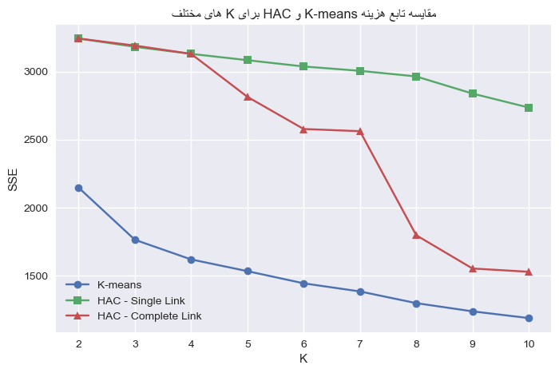
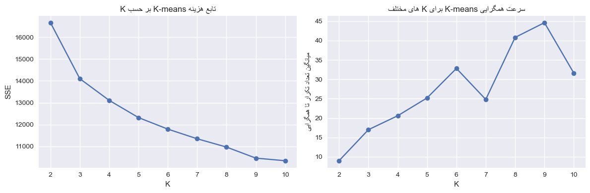

## پروژه ۴ و ۵: خوشه‌بندی مشتریان با K-means و HAC

این مخزن شامل پیاده‌سازی و تحلیل دو الگوریتم خوشه‌بندی **K-means** و **خوشه‌بندی سلسله‌مراتبی تجمعی (HAC)** روی مجموعه‌دادهٔ *Customer marketing* است. هدف، تصمیم‌سازی و تحلیل رفتار مشتریان بر اساس ویژگی‌های عددی و مقایسهٔ عملکرد این دو روش است.

---

## داده و پیش‌پردازش

فایل داده در مسیر زیر قرار دارد:

- `data/Customer marketing.csv`

در نوت‌بوک، ابتدا داده بارگذاری شده و تعدادی ویژگی عددی مرتبط برای خوشه‌بندی انتخاب شده‌اند؛ از جمله:

- `Income`
- `MntWines`, `MntFruits`, `MntMeatProducts`, `MntFishProducts`, `MntSweetProducts`, `MntGoldProds`
- `NumDealsPurchases`, `NumWebPurchases`, `NumCatalogPurchases`, `NumStorePurchases`
- `NumWebVisitsMonth`

سپس:

- سطرهای دارای مقادیر گمشده در این ویژگی‌ها حذف شده‌اند.
- داده‌ها با نرمال‌سازی استاندارد (میانگین صفر و انحراف معیار یک) مقیاس‌بندی شده‌اند تا همهٔ ویژگی‌ها در یک سطح مقیاس قرار گیرند و روی فاصلهٔ اقلیدسی تأثیر غالب نگذارند.

نمونه کد پیش‌پردازش:

```python
numeric_features = [
    "Income",
    "MntWines",
    "MntFruits",
    "MntMeatProducts",
    "MntFishProducts",
    "MntSweetProducts",
    "MntGoldProds",
    "NumDealsPurchases",
    "NumWebPurchases",
    "NumCatalogPurchases",
    "NumStorePurchases",
    "NumWebVisitsMonth",
]

df_numeric = df[numeric_features].dropna()
X = df_numeric.values.astype(float)

X_mean = X.mean(axis=0)
X_std = X.std(axis=0)
X_std[X_std == 0] = 1.0
X_scaled = (X - X_mean) / X_std
```

---

## الگوریتم K-means

### ایدهٔ اصلی

K-means داده‌ها را به K خوشه تقسیم می‌کند به طوری که مجموع مربعات فاصلهٔ نقاط از مرکز خوشه‌شان (**SSE**) حداقل شود. در این پیاده‌سازی:

- مراکز اولیه به صورت **تصادفی** از بین نمونه‌ها انتخاب می‌شوند.
- در هر تکرار، هر نقطه به نزدیک‌ترین مرکز تخصیص داده می‌شود.
- مراکز خوشه‌ها با میانگین نقاط هر خوشه به‌روزرسانی می‌شوند.
- روند تا همگرایی (جابجایی کم مراکز) یا رسیدن به حداکثر تعداد تکرار ادامه می‌یابد.

### پیاده‌سازی

نمونه‌ای از تابع `kmeans`:

```python
def kmeans(X, k, max_iters=100, tol=1e-4, random_state=None):
    rng = np.random.default_rng(random_state)
    n_samples = X.shape[0]
    indices = rng.choice(n_samples, size=k, replace=False)
    centroids = X[indices].copy()

    for it in range(max_iters):
        distances = np.linalg.norm(X[:, None, :] - centroids[None, :, :], axis=2)
        labels = np.argmin(distances, axis=1)

        new_centroids = np.zeros_like(centroids)
        for j in range(k):
            mask = labels == j
            if np.any(mask):
                new_centroids[j] = X[mask].mean(axis=0)
            else:
                new_centroids[j] = X[rng.integers(0, n_samples)]

        shift = np.linalg.norm(new_centroids - centroids)
        centroids = new_centroids
        if shift < tol:
            break

    distances = np.linalg.norm(X[:, None, :] - centroids[None, :, :], axis=2)
    labels = np.argmin(distances, axis=1)
    sse = np.sum((X - centroids[labels]) ** 2)

    return labels, centroids, sse, it + 1
```

در انتها:

- `labels`: برچسب خوشهٔ هر نقطه
- `centroids`: مراکز نهایی خوشه‌ها
- `sse`: مقدار تابع هزینه (SSE)
- `it + 1`: تعداد تکرارهایی که تا همگرایی صرف شده است

### بررسی سرعت همگرایی و انتخاب K

برای تحلیل رفتار الگوریتم نسبت به K، تابعی نوشته شده که برای چند مقدار مختلف K (مثلاً ۲ تا ۱۰) چند بار K-means را با مقداردهی اولیهٔ تصادفی اجرا می‌کند و:

- بهترین SSE (کمترین مقدار) را برای هر K ثبت می‌کند.
- میانگین تعداد تکرار تا همگرایی را برای هر K محاسبه می‌کند.

سپس دو نمودار رسم می‌شود:

1. **SSE بر حسب K** (منحنی آرنج):  
   

2. **میانگین تعداد تکرار تا همگرایی بر حسب K**  

از نمودار SSE می‌توان با روش «آرنج» K مناسب را انتخاب کرد؛ جایی که با افزایش K، کاهش SSE کند می‌شود و مزیت تقسیم بیشتر خوشه‌ها کم است.

---

## الگوریتم HAC (خوشه‌بندی سلسله‌مراتبی تجمعی)

### ایدهٔ اصلی

در HAC از هر نمونه یک خوشهٔ تک‌عضوی شروع می‌شود و در هر مرحله نزدیک‌ترین دو خوشه ادغام می‌شوند تا در نهایت به یک خوشه برسیم. تفاوت روش‌ها در تعریف **فاصله بین خوشه‌ها** است:

- **نزدیک‌ترین زوج (Single Linkage)**: فاصلهٔ دو خوشه، کمترین فاصلهٔ بین هر جفت نقطه از دو خوشه است.
- **دورترین زوج (Complete Linkage)**: فاصلهٔ دو خوشه، بیشترین فاصلهٔ بین هر جفت نقطه از دو خوشه است.

برای جلوگیری از انفجار محاسباتی، HAC روی یک زیرمجموعهٔ تصادفی از داده (مثلاً ۳۰۰ نمونه) اجرا شده است.

### پیاده‌سازی خلاصه

ابتدا ماتریس فاصلهٔ اقلیدسی بین همهٔ نمونه‌ها محاسبه می‌شود. سپس در هر مرحله:

- نزدیک‌ترین دو خوشه در ماتریس فاصله پیدا می‌شوند.
- آن‌ها ادغام می‌شوند و خوشهٔ جدید جایگزین می‌شود.
- فاصلهٔ خوشهٔ جدید با سایر خوشه‌ها بسته به نوع لینک (min یا max) به‌روزرسانی می‌شود.
- بعد از هر ادغام، SSE افراز فعلی (مجموع SSE هر خوشه) محاسبه و مقدار آن روی تعداد خوشه‌های فعلی (K) ذخیره می‌شود.

نمونه‌ای از کد:

```python
def compute_sse_for_clusters(X, clusters):
    sse = 0.0
    for idx in clusters:
        points = X[idx]
        center = points.mean(axis=0)
        diff = points - center
        sse += np.sum(diff ** 2)
    return sse

def hac_costs(X, linkage="single"):
    n = X.shape[0]
    base_dist = pairwise_distances(X)
    np.fill_diagonal(base_dist, np.inf)

    clusters = [np.array([i]) for i in range(n)]
    cluster_dist = base_dist.copy()

    ks = [n]
    sses = [0.0]

    while len(clusters) > 1:
        m = len(clusters)
        i, j = divmod(np.argmin(cluster_dist), m)
        if i == j:
            break
        if i > j:
            i, j = j, i

        new_cluster = np.concatenate([clusters[i], clusters[j]])
        clusters[i] = new_cluster
        del clusters[j]

        # به‌روزرسانی فاصله‌ها بر اساس نوع لینک
        new_dist = np.full((m - 1, m - 1), np.inf)
        for a in range(m - 1):
            for b in range(a + 1, m - 1):
                if a == i:
                    if b >= j:
                        d1 = cluster_dist[i, b + 1]
                        d2 = cluster_dist[j, b + 1]
                    else:
                        d1 = cluster_dist[i, b]
                        d2 = cluster_dist[j, b]
                    if linkage == "single":
                        d = min(d1, d2)
                    else:
                        d = max(d1, d2)
                    new_dist[i, b] = d
                    new_dist[b, i] = d
                else:
                    ai = a if a < j else a + 1
                    bi = b if b < j else b + 1
                    d = cluster_dist[ai, bi]
                    new_dist[a, b] = d
                    new_dist[b, a] = d

        cluster_dist = new_dist
        np.fill_diagonal(cluster_dist, np.inf)

        sse = compute_sse_for_clusters(X, clusters)
        ks.append(len(clusters))
        sses.append(sse)

    ...
```

این تابع برای هر دو حالت `linkage="single"` و `linkage="complete"` اجرا شده و برای Kهای مختلف مقدار SSE محاسبه شده است.

---

## مقایسه تابع هزینه K-means و HAC

برای مقایسهٔ منصفانه، الگوریتم K-means روی همان زیرمجموعه‌ای از داده که HAC روی آن اجرا شده اعمال شده است. سپس برای چند مقدار K مشترک (مثلاً ۲ تا ۱۰)، SSE سه روش زیر روی یک نمودار رسم شده است:

- K-means
- HAC با نزدیک‌ترین زوج (Single Linkage)
- HAC با دورترین زوج (Complete Linkage)

نمودار مقایسه:



**برداشت‌ها:**

- با افزایش K، انتظار می‌رود SSE در هر سه روش کاهش یابد، چون خوشه‌ها ریزتر می‌شوند و نقاط به مراکز نزدیک‌تر می‌شوند.
- شکل منحنی K-means معمولاً نرم‌تر بوده و برای استفاده از روش آرنج مناسب است.
- در HAC، بسته به نوع لینک، شکل منحنی می‌تواند متفاوت باشد:
  - Single Linkage تمایل دارد خوشه‌هایی با زنجیره‌های طولانی بسازد و ممکن است نسبت به نویز حساس باشد.
  - Complete Linkage خوشه‌هایی فشرده‌تر ایجاد می‌کند و به فاصلهٔ نقطهٔ دورتر حساس‌تر است.

با مقایسهٔ این منحنی‌ها می‌توان:

- یک بازهٔ مناسب برای K انتخاب کرد.
- دربارهٔ این که کدام روش برای این مجموعه‌داده خوشه‌هایی با تفسیر بهتر تولید می‌کند، بحث کرد.

---